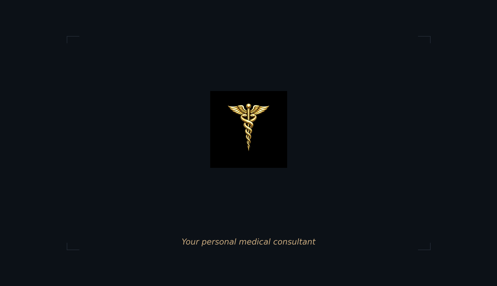
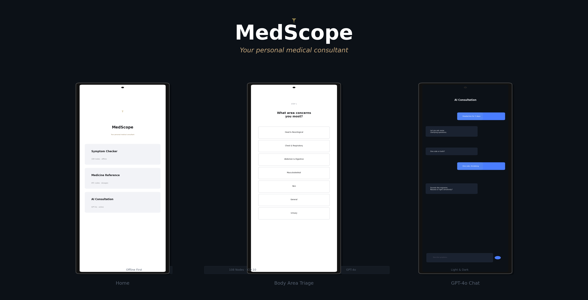
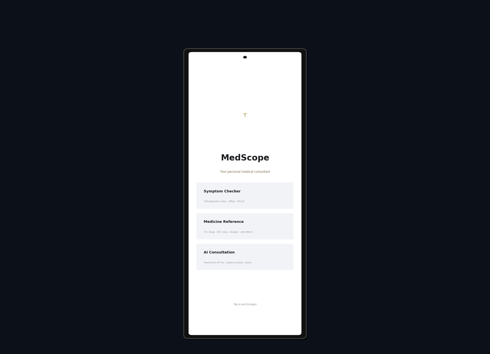
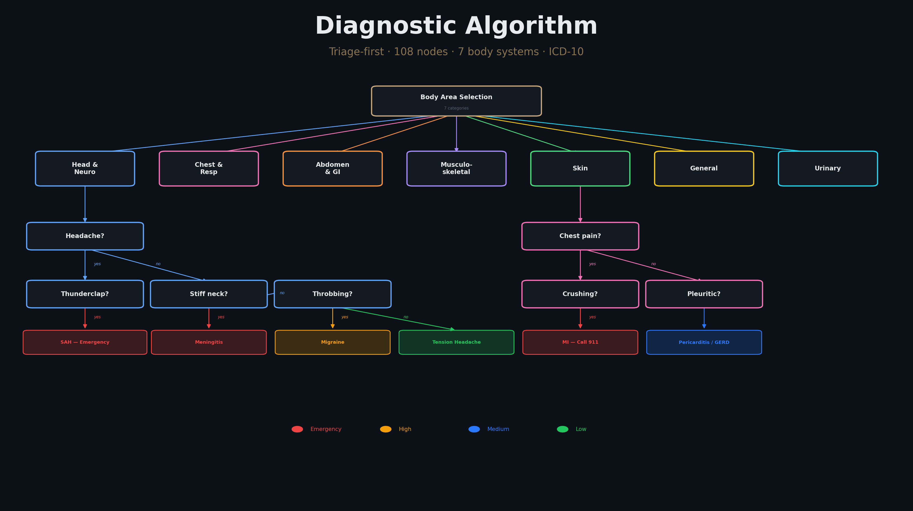
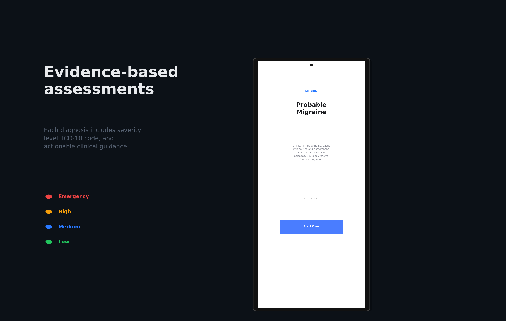
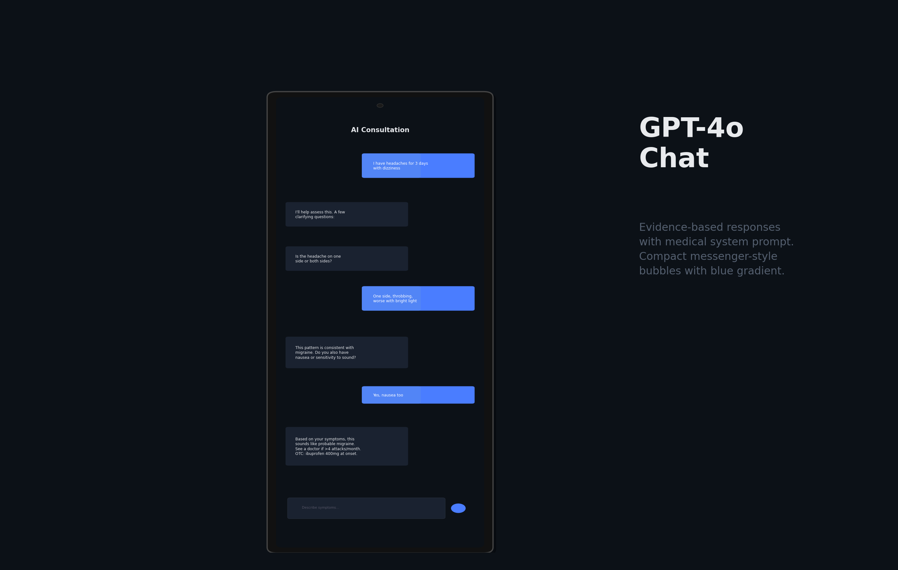
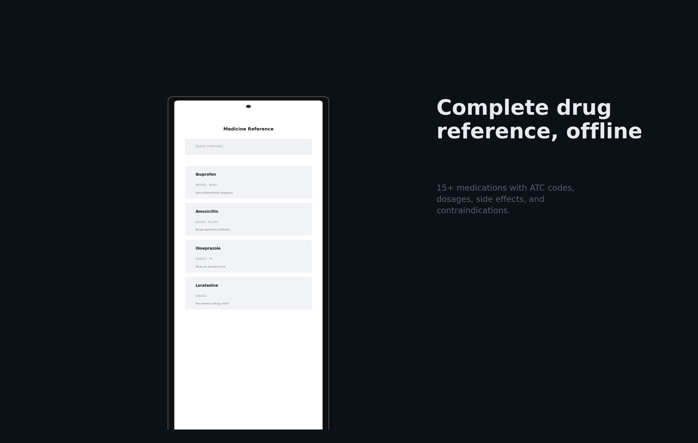
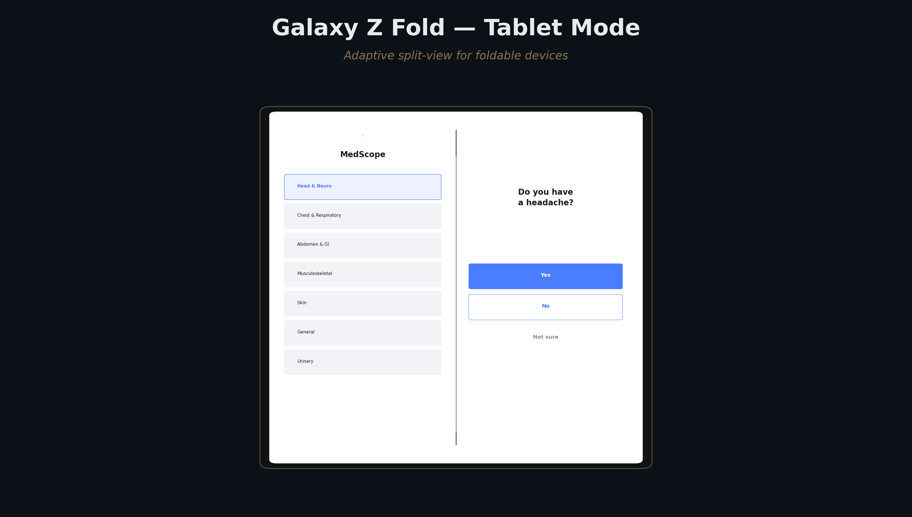
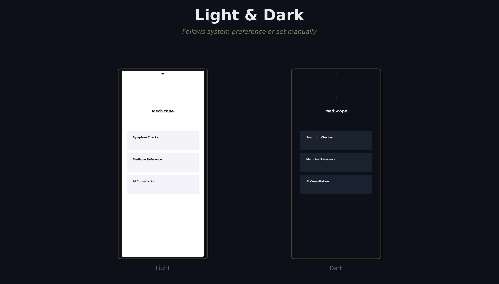
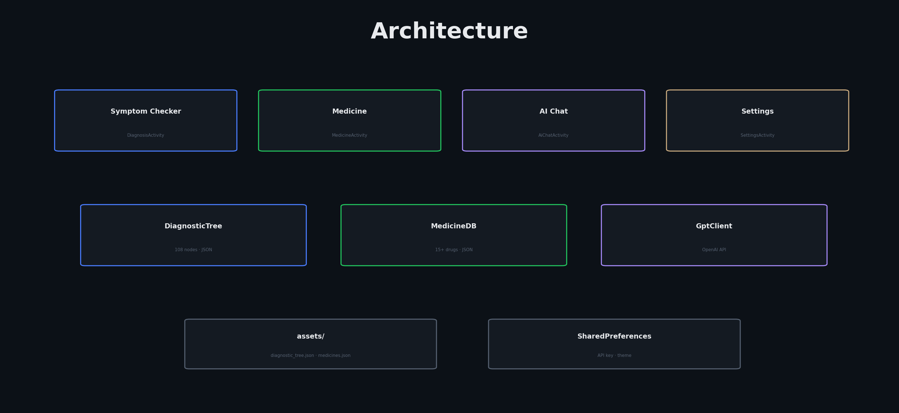

<p align="center">
  
</p>

<p align="center">
  
  
  
  
  
  <a href="LICENSE"></a>
</p>

---

<p align="center">
  
</p>

**MedScope** is a native Android medical consultant application. It combines a 108-node offline diagnostic algorithm with a searchable drug reference and GPT-4o AI consultation, wrapped in a Material Design 3 interface with light and dark themes.

---

## Home Screen

<p align="center">
  
</p>

---

## Diagnostic Algorithm

<p align="center">
  
</p>

Triage-first approach with 108 nodes spanning 7 body systems. Emergency conditions detected early with explicit "Call 911" instructions. Every diagnosis carries a severity level, ICD-10 code, and actionable clinical guidance.

---

## Diagnosis Results

<p align="center">
  
</p>

---

## AI Consultation

<p align="center">
  
</p>

---

## Medicine Reference

<p align="center">
  
</p>

---

## Galaxy Z Fold

<p align="center">
  
</p>

---

## Light & Dark Mode

<p align="center">
  
</p>

---

## Architecture

<p align="center">
  
</p>

## Build & Run

```bash
git clone https://github.com/charonviz/MOBILE_MEDICAL_CONSULTANT.git
cd MOBILE_MEDICAL_CONSULTANT
./gradlew assembleDebug
```

To enable AI Consultation, go to Settings and enter your OpenAI API key.

## Disclaimer

MedScope is for informational and educational purposes only. Always consult a qualified healthcare professional.

## License

MIT — Copyright (c) 2023–2025 Maksim Nikonov.
